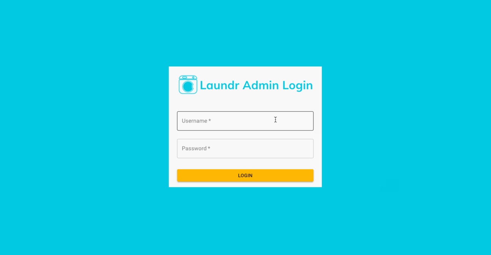
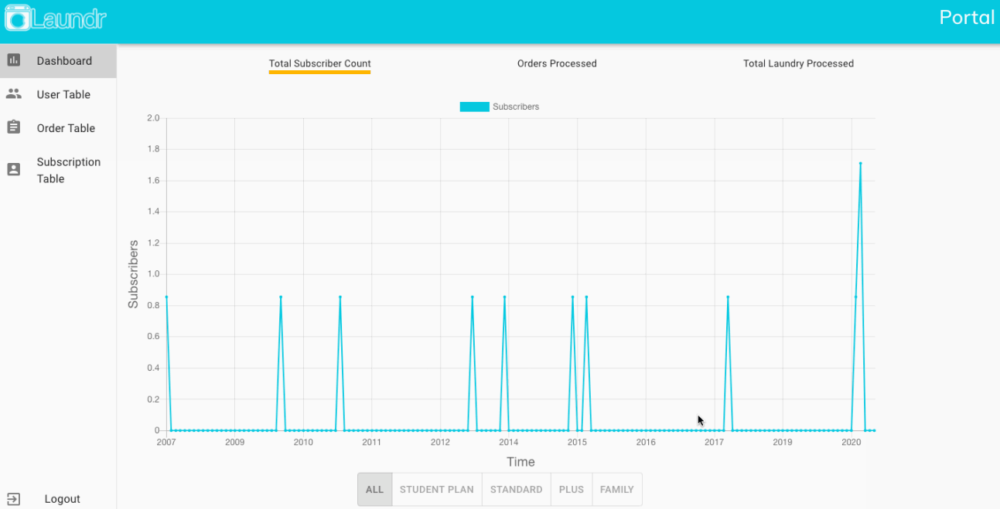

[![Issues][issues-shield]][issues-url]


<!-- PROJECT LOGO -->
<br />
<p align="center">
  <a href="https://github.com/ray7yu/laundr-portal">
    
  </a>
   <h3 align="center">Laundr-Portal</h3>
  <p align="center">
  Administrative portal that allows Laundr employees
to seamlessly view relevant data about their operations through a web browser
    <br />
    <a href="https://github.com/ray7yu/laundr-portal"><strong>Explore the docs »</strong></a>
    <br />
    <br />
    ·
    <a href="https://github.com/ray7yu/laundr-portal/issues">Report Bug</a>
    ·
    <a href="https://github.com/ray7yu/laundr-portal/issues">Request Feature</a>
  </p>
</p>


<!-- TABLE OF CONTENTS -->
## Table of Contents

* [About the Project](#about-the-project)
* [Built With](#built-with)
* [Getting Started](#getting-started)
* [Prerequisites](#prerequisites)
* [Installation](#installation)
* [Usage](#usage)
* [License](#license)
* [Contact](#contact)
* [Acknowledgements](#acknowledgements)

<!-- ABOUT THE PROJECT --> 
## About The Project

The goal of the project was to build and deploy a portal that allows the client, a [Laundr](https://www.laundr.io/) administrator, to seamlessly view relevant data about the operations of Laundr through a browser. The main pages, Users, Orders, and Subscriptions, are tables in which the columns are the attributes and the rows are the entries from the MongoDB database. The dashboard, which is the default page, includes 3 graphs that show subscriber count, orders processed, and weight processed. These graphs also contain filters that allow the administrator specify how they wish to view them.

### Built With
* [React](https://reactjs.org/)
* [HTML/CSS](google.com)
* [Node.js](https://nodejs.org/en/)
* [Express](https://expressjs.com/)
* [Mongoose](https://mongoosejs.com/)
* [MongoDB Atlas](https://www.mongodb.com/cloud/atlas)
* [Postman](https://www.postman.com/)
* [Material UI](https://material-ui.com/)
* [Chart.Js](https://www.chartjs.org/)

<!-- GETTING STARTED -->
## Getting Started

Installation should be simple. You install some IDE, clone the repo and install the necessary packages. 

### Prerequisites
1. Download any IDE

### Installation

1. Clone the repo
```sh
git clone https://github.com/ray7yu/laundr-portal.git
```
2. Open a terminal to the newly created directory.
3. Install packages
```sh
npm install
```

<!-- USAGE EXAMPLES -->
## Usage
 1. Log in via the admin portal
 
 
2. Once on the dashboard, select which tab you would like to view
 
 
 3. Using the different filter options you can search through each table to view customer data.
  
  
  
 ##  Project Features

1. Base Features
```sh
-Dashboard that contains graphs to visualize data along with filters
-Tables that display the entries and their respective attributes
-MongoDB Atlas that stores the relevant information
-User authentication for login
-Side menu navigation (default should be dashboard)
-Logout feature
-Dropdown menus on each table to select how much 
-Deployment on Heroku
-API that allows requests to get all, add, or delete from a database
```

2. Pages
```sh
1. Dashboard with 3 tabbed Line Graphs 
-Total subscriber count (All / Student plan / Standard / Plus / Family)
-Orders processed (today / last 7 days / last 30 days / all time)
-Total LBS of laundry processed (today / last 7 days / last 30 days / all time)

2. Users table
-User Name 
-Email
-Account Created Date

3. Orders table
-Order Number
-Customer Name
-Pickup Time
-Delivery Time
-Driver Name
-Customer Address
-Order Status
-Order Weight

4. Subscriptions table
-Customer Name
-Subscription Type
-Start Date
-Renewal Date
-Max Lbs
-Current Lbs
-IsActive
```
3. Additional Features
```sh
-Option to condense entries on each table
-Aesthetically pleasing UI that follows Laundr’s style guidelines 
```


<!-- LICENSE -->
## License


<!-- CONTACT -->
## Contact
Raymond Yu - wrg7yu@gmail.com 
[![LinkedIn][linkedin-shield]][linkedin-url-raymond]

Joseph Morales - JosephMorales007@Yahoo.com
[![LinkedIn][linkedin-shield]][linkedin-url-joseph]

Shen-Jou Tsai - shenjou.tsai@ufl.edu
[![LinkedIn][linkedin-shield]][linkedin-url-grace]

Jayden Jones - jayden.jones@ufl.edu
[![LinkedIn][linkedin-shield]][linkedin-url-jayden]

Vincent Concepcion - vconcepcion@ufl.edu
[![LinkedIn][linkedin-shield]][linkedin-url-vincent]


# laundr-portal
[Heroku link](https://laundr-portal.herokuapp.com/)

[https://github.com/ray7yu/laundr-portal](https://github.com/ray7yu/laundr-portal.git)


<!-- ACKNOWLEDGEMENTS -->
## Acknowledgements
* [University of Florida](https://www.ufl.edu/)


<!-- MARKDOWN LINKS & IMAGES -->
<!-- https://www.markdownguide.org/basic-syntax/#reference-style-links -->
[linkedin-shield]: https://img.shields.io/badge/-LinkedIn-black.svg?style=flat-square&logo=linkedin&colorB=555
[linkedin-url-raymond]: https://www.linkedin.com/in/ray7yu/

[linkedin-shield]: https://img.shields.io/badge/-LinkedIn-black.svg?style=flat-square&logo=linkedin&colorB=555
[linkedin-url-joseph]: https://www.linkedin.com/in/josephmorales007/

[linkedin-shield]: https://img.shields.io/badge/-LinkedIn-black.svg?style=flat-square&logo=linkedin&colorB=555
[linkedin-url-jayden]: https://www.linkedin.com/in/jayden-jones-6b66141b5/

[linkedin-shield]: https://img.shields.io/badge/-LinkedIn-black.svg?style=flat-square&logo=linkedin&colorB=555
[linkedin-url-grace]: https://www.linkedin.com/in/shen-jou-tsai-01a13a158/

[linkedin-shield]: https://img.shields.io/badge/-LinkedIn-black.svg?style=flat-square&logo=linkedin&colorB=555
[linkedin-url-vincent]: https://www.linkedin.com/in/vincent-concepcion-34b0811a5/

[issues-shield]: https://img.shields.io/github/issues/laundr-portal.svg?style=flat-square
[issues-url]: https://github.com/ray7yu/laundr-portal/issues
[product-screenshot]: images/screenshot.png
